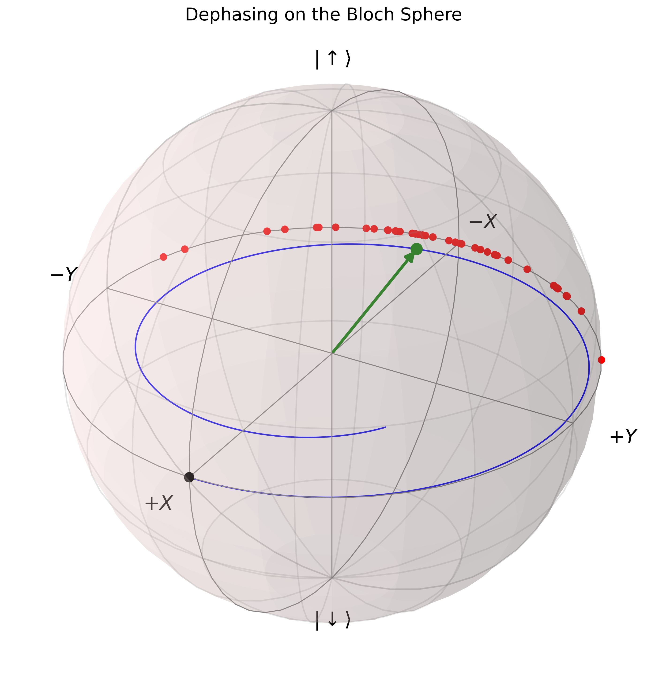
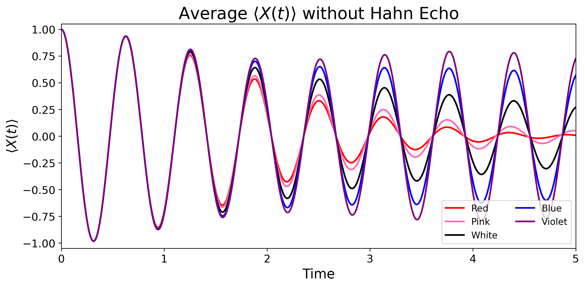
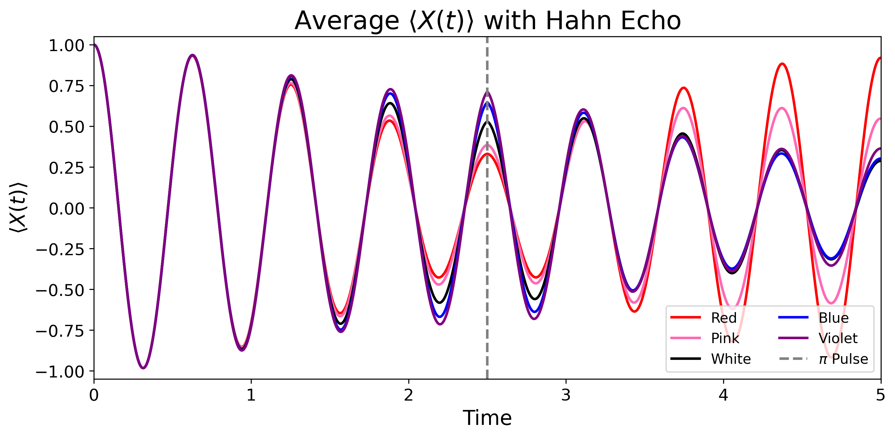

# Spin-½ Qubit Dephasing Under Colored Magnetic-Field Noise

This project investigates how different frequency distributions of magnetic field noise impact the coherence of a spin and how a Hahn echo pulse sequence can mitigate this dephasing.

This project starts by simulating the evolution of a spin under a noisy magnetic field and comparing multiple numerical methods for solving the time-dependent Schrödinger equation with analytical solutions. Deterministic and stochastic noise are tested, including colored noise generated based on different power spectral densities. Then, a Hahn echo is applied to mitigate different frequency distributions of noise.

## Physical Model

The qubit is modeled as a spin-1/2 system with state

\[
|\psi(t)\rangle =
\begin{pmatrix}
\alpha(t) \\
\beta(t)
\end{pmatrix}.
\]

The magnetic field is decomposed into

\[
B_z(t)=B_0+\delta B(t),
\]

where \(B_0\) is the constant average magnetic field and \(\delta B(t)\) represents the fluctuations due to noise.

The constant magnetic field causes the spin to precess or rotate around the magnetic field axis. The fluctuations in the magnetic field cause different trials of the spin to accumulate different phase angles. These phase angles spread out over many noise trials, leading to a loss of coherence or dephasing.

*This is a visualization of dephasing on the Bloch sphere. Different noise realizations, which are shown by the red dots, accumulate different phases, causing the average spin coherence to decrease, which is shown by the blue line spiraling inward.*

The main observable used throughout the simulations to model coherence is

\[
\langle X(t)\rangle = 2\operatorname{Re}[\alpha^*(t)\beta(t)].
\]

## Numerical Evolution

The time-dependent Schrödinger equation is solved through the use of multiple numerical methods:

- Euler's method
- Improved Euler's method (Heun's method)
- Fourth-order Runge-Kutta (RK4)

The results from the numerical methods are compared with the analytical solution when an exact solution is available.

## Deterministic Magnetic-Field Noise

Multiple deterministic variations of magnetic field noise are studied, including:

- Sine waves
- Multiple superimposed sine waves
- Square pulses
- Gaussian pulses

These simulations allow for controlled testing of the numerical methods of evolution and show how time-dependent magnetic fields impact the phase accumulation of the spin.

## Colored Noise

The stochastic part of the project studies different colors or frequency distributions of noise.

Five noise colors are compared:

| Noise Color | Frequency Dependence |
|-------------|----------------------|
| Red | \(S(\omega)\propto\omega^{-2}\) |
| Pink | \(S(\omega)\propto\omega^{-1}\) |
| White | \(S(\omega)\propto\omega^0\) |
| Blue | \(S(\omega)\propto\omega^1\) |
| Violet | \(S(\omega)\propto\omega^2\) |

The noise signals are normalized to have the same variance or noise strength. This is in order to isolate the effects of their frequency distributions.

The noise is analyzed in the time domain as well as the frequency domain through correlation functions and power spectral densities (PSDs).

## Dephasing

Different noise colors with the same variance produce different qubit dynamics or dephase differently. In these simulations, low-frequency noise remains correlated for long periods of time, so it pushes the phase in a similar direction, leading to larger accumulated phase errors. Higher-frequency noise fluctuates rapidly, so some phase contributions can cancel each other out, leading to smaller accumulated phase errors.

*This graph shows the average spin evolution without a Hahn echo being applied. The decreasing oscillation amplitudes show dephasing due to noise, while the different rates of decay show how the frequency distribution of noise affects the coherence.*

These simulations emphasize that it is important to study the power spectral density of the noise, rather than just the variance, in order to properly predict a spin’s evolution.

## Hahn Echo

A Hahn echo pulse sequence is used to mitigate dephasing from the magnetic field noise.

A \(\pi\) pulse about the y-axis is applied halfway through the spin’s evolution.

This pulse reverses the direction of the phase accumulation for the second half of the evolution. Since low-frequency noise is slowly varying, it produces approximately the same phase errors in the first and second half of the evolution, making the Hahn echo pulse very effective at allowing the spin to recover coherence.

*This graph shows the average spin evolution with a Hahn echo being applied at the midpoint. Low-frequency noise is refocused more effectively as its fluctuations remain correlated across both halves of the evolution.*

These simulations show that a Hahn echo pulse sequence is particularly effective against low-frequency noise such as red and pink noise. High-frequency blue and violet noise is less effectively mitigated by a single Hahn echo pulse.

## Main Results

- Noise in a magnetic field causes spin dephasing through random realizations accumulating different phases, which partially cancel out when averaged over numerous trials.
- Noise with equal variance can dephase very differently depending on its frequency distribution.
- In these simulations, low-frequency noise dephases much more quickly as it pushes the phase accumulation in a similar direction for a relatively long period of time.
- Hahn echo reverses the direction of phase accumulation, meaning it is effective for low-frequency noise, as low-frequency noise is highly correlated.
- Understanding the power spectral density and the correlation function of noise is crucial to properly understand the effect of the noise on spin coherence.

## Repository Structure

- `noiseProjectBase.py` — Main functions for spin evolution and numerical methods.
- `Dephasing.ipynb` — Visualizations to clearly show noise and the effect of dephasing.
- `DeterministicNoise.ipynb` — Deterministic noise realizations: Sine wave, square pulse, Gaussian pulse, and multiple superimposed sine waves.
- `LorentzianNoise.ipynb` — Simulations involving correlated Lorentzian/Red noise.
- `DifferentColorsNoise.ipynb` — Analysis and generation of different colors of noise, their power spectral densities, and correlation functions.
- `HahnEcho.ipynb` — Implementation and testing of the Hahn echo sequence for random noise.
- `ColorsHahnEcho.ipynb` — Comparison of the Hahn echo sequence used across different noise colors.

## Requirements

The simulations use Python with:

- NumPy
- Matplotlib
- SciPy
- QuTiP

